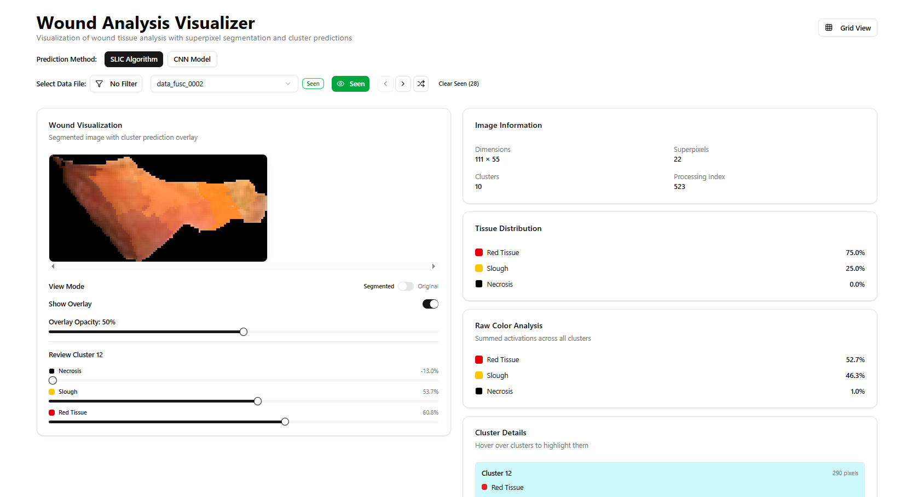

# Wound Analysis Visualizer (Labeler de Dados SLIC)

Aplicação Next.js para visualizar a análise de tecidos de feridas com segmentação por superpixels e predições de clusters. Combina classificação baseada no algoritmo **SLIC** e predições de um modelo **CNN**, além de fluxos de rotulagem (supervisão) para decisões de dosagem de fotobiomodulação (PBM).



## Visão Geral

Este repositório faz parte do projeto de determinação de parâmetros de feridas (`wound-parameter-determination`). Ele serve como ferramenta de **rotulagem e visualização** de dados gerados pelo pipeline SLIC, permitindo revisão humana, supervisão de dosagem e exportação de resultados.

## Funcionalidades

- **Visualização SLIC**: exibe a análise da ferida usando o algoritmo SLIC (Simple Linear Iterative Clustering).
- **Visualização CNN**: exibe a análise usando um modelo CNN treinado para classificação de tecidos mais precisa.
- **Interface interativa**: clique e passe o mouse sobre os clusters para inspecionar a composição detalhada de tecidos.
- **Comparação com imagem original**: alterne entre a imagem segmentada e a original.
- **Visão em grade (Grid)**: navegue pelas amostras em uma grade paginada.
  - Mostra as imagens originais da ferida por padrão.
  - Ao passar o mouse, exibe a visão segmentada com sobreposição de tecidos.
  - Exibe percentuais de composição de tecido.
  - Indicadores visuais de arquivos revisados e vistos.
  - Clique para ir para a visão detalhada.
  - Paginação (24 amostras por página) para melhor desempenho.
  - Carregamento em lote (uma única requisição de API por página).
- **Sistema de revisão**: revisão e correção manual das classificações de clusters.
- **Supervisão de dosagem**: fluxo de rotulagem assistido (cego/contexto/sugestão) para decisões de dosagem PBM.
- **Rastreamento de "visto"**: marque amostras como vistas para evitar revisá-las várias vezes.
  - O seletor aleatório prioriza amostras não vistas.
  - Indicadores visuais persistentes entre sessões.
- **Filtragem inteligente**: ordene arquivos por composição de tecido (necrose, slough, tecido vermelho).

## Páginas

- `/` — Visualizador principal (SLIC/CNN) com revisão e filtros.
- `/grid` — Visão em grade paginada das amostras.
- `/dashboard` — Painel com gráficos e estatísticas dos datasets.
- `/inferences` — Listagem de inferências salvas (via Supabase).
- `/json-view` — Visualizador e copiador de JSON de classificações.
- `/lista-avaliacoes` — Lista de avaliações realizadas.
- `/download` — Exportação/baixar dados rotulados.
- `/pwat` — Ferramenta relacionada a escores PWA (Pressure Ulcer/Wound Assessment Tool).
- `/pipeline-demo` — Demonstração do pipeline de processamento de imagens.
- `/dosage-supervision` — Interface de rotulagem de dosagem PBM (fluxo completo).
- `/minimalistic-supervision` e `/minimalistic-supervision-v2` — Versões enxutas do fluxo de supervisão.

## Como começar

### Pré-requisitos

1. **Node.js** (v18 ou superior)
2. **Bun** (recomendado) ou npm
3. **Python** (v3.8 ou superior) — necessário para inferência CNN

### Instalação

1. Instale as dependências do Node:

```bash
npm install
# ou
bun install
```

2. Instale as dependências Python para inferência CNN:

```bash
pip install -r scripts/requirements.txt
```

### Executando a aplicação

Inicie o servidor de desenvolvimento:

```bash
npm run dev
# ou
bun dev
```

Abra [http://localhost:3000](http://localhost:3000) no navegador.

### Variáveis de ambiente

Crie o `.env.local` a partir do `.env.example` antes de usar as páginas com Supabase:

```bash
cp .env.example .env.local
```

Defina:

```env
NEXT_PUBLIC_SUPABASE_URL=https://your-project-ref.supabase.co
NEXT_PUBLIC_SUPABASE_PUBLISHABLE_KEY=your-anon-or-publishable-key
```

Use apenas a chave anon/publicável do Supabase. Nunca coloque uma chave `service_role` em variáveis `NEXT_PUBLIC_*`.

Para uma demonstração local de dosagem que não grava no Supabase, defina também:

```env
NEXT_PUBLIC_DOSAGE_DEMO_MODE=1
```

## Estrutura do projeto

```
.
├── app/
│   ├── api/                      # Rotas de API
│   │   ├── cnn-predict/          # Endpoint de inferência CNN
│   │   ├── data-files/           # Endpoints de arquivos de dados
│   │   ├── data-files-bulk/      # Endpoint otimizado de carregamento em lote
│   │   ├── data-files-sorted/    # Endpoints de arquivos ordenados/filtrados
│   │   ├── dataset-statistics/   # Estatísticas do dataset
│   │   ├── dosage-supervision/   # API do fluxo de supervisão de dosagem
│   │   ├── supervision/          # Classificações SLIC/VLM (slic.csv, vlm.csv)
│   │   ├── check-review/         # Verificação de revisões
│   │   ├── save-review/          # Salvamento de revisões
│   │   ├── upload/               # Upload de arquivos
│   │   └── original-image/       # Endpoints de imagem original
│   ├── data/                     # Dados de feridas processados pelo SLIC
│   ├── dataset_reviewed/         # Correções revisadas por humanos
│   ├── images/                   # Imagens originais de treinamento
│   ├── inferences/               # Listagem de inferências (Supabase)
│   ├── grid/                     # Página de visão em grade
│   ├── dashboard/                # Painel de estatísticas
│   ├── dosage-supervision/       # Interface de rotulagem de dosagem PBM
│   ├── minimalistic-supervision/ # Versão enxuta da supervisão
│   ├── minimalistic-supervision-v2/
│   ├── pipeline-demo/            # Demonstração do pipeline
│   ├── pwat/                     # Ferramenta de escores PWA
│   ├── json-view/                # Visualizador de JSON
│   ├── lista-avaliacoes/         # Lista de avaliações
│   └── download/                 # Exportação de dados
├── components/
│   ├── ui/                       # Componentes shadcn/ui
│   ├── wound-visualizer.tsx      # Componente de visualização SLIC
│   └── wound-visualizer-cnn.tsx  # Componente de visualização CNN
├── lib/
│   ├── dosage/                   # Atribuição de dosagem, demo e regras
│   ├── types/                    # Definições de tipos TypeScript
│   └── utils.ts                  # Utilitários gerais
├── scripts/
│   ├── cnn_inference.py          # Script Python de inferência CNN
│   ├── requirements.txt          # Dependências Python
│   └── smoke-dosage-context.mjs  # Smoke test do contexto de dosagem
└── supabase/                     # Migrações e configuração do Supabase
```

## Como funciona

### Visualização SLIC (padrão)

O algoritmo SLIC segmenta a imagem da ferida em superpixels e os classifica com base na análise de cor em múltiplos espaços de cor (CIELab, RGB, CMYK). Cada cluster recebe escores de tipo de tecido para:

- **Necrose** (tecido negro)
- **Slough** (tecido amarelo)
- **Tecido vermelho** (tecido de granulação saudável)

### Visualização CNN

O modelo CNN refina as predições SLIC usando uma arquitetura de entrada dupla:

1. **Caminho da imagem completa**: captura o contexto global da ferida.
2. **Caminho da máscara de cluster**: foca nas características específicas do cluster.
3. **Entrada de escores SLIC**: usa as predições iniciais do SLIC como características adicionais.

O modelo gera escores refinados de classificação de tecido para cada cluster, melhorando a acurácia em relação à abordagem SLIC tradicional.

**Recursos de desempenho:**

- **Cache automático**: as predições CNN são cacheadas após a primeira execução.
- **Atualização manual**: use o botão de atualizar para reexecutar a inferência.
- **Indicador de cache**: o selo "Cached" mostra quando veio do cache.

## Treinamento do modelo

O modelo CNN foi treinado em imagens de feridas com correções revisadas por humanos. Para detalhes de treinamento, veja o script `cnn_finetuning.py` no repositório pai.

Arquitetura:

- Entrada: imagens RGB 64x64 (completa + máscara de cluster) + escores SLIC
- Caminhos convolucionais duplos com batch normalization
- Camadas totalmente conectadas com dropout
- Saída: 3 escores de tipo de tecido (necrose, slough, tecido_vermelho)

## Uso

### Visão detalhada (página principal)

1. **Selecione um arquivo de dados** no menu suspenso.
2. **Escolha o método de predição**: SLIC (rápido) ou CNN (mais preciso, com cache).
3. **Interaja com a visualização**: clique/hover nos clusters, alterne opacidade e views.
4. **Revise e corrija** (modo SLIC): ajuste escores e salve correções.
5. **Gerencie o cache** (modo CNN): atualize para reexecutar inferência.
6. **Rastreie amostras vistas**: "Marcar como visto", seletor aleatório prioriza não vistas.
7. **Filtre e ordene**: por necrose, slough ou tecido vermelho.

### Visão em grade

1. Acesse via botão "Grid View".
2. Navegue em páginas de 24 amostras.
3. Cada card mostra imagem, nome, composição de tecido e badges de status.
4. Hover alterna para a visão segmentada.
5. Clique para abrir a análise detalhada.

### Supervisão de dosagem

Abra `/dosage-supervision` para rotular decisões de dosagem de fotobiomodulação.

O fluxo atribui cada imagem em três modos de apresentação:

- `blind`: rotulagem apenas com a imagem.
- `context`: rotulagem com contexto de ferida derivado.
- `suggestion_review`: rotulagem com contexto + sugestão de dosagem baseada em regras.

As atribuições vêm da lista completa em `app/data/images_list.json`. O contexto do caso é enriquecido a partir das saídas de classificação em `app/api/supervision/slic.csv` e `app/api/supervision/vlm.csv`. Se uma imagem não tiver linha de classificação, a API retorna metadados de produção com disponibilidade falsa e a sugestão cai para `not_sure`.

Os rótulos são armazenados na tabela `public.dosage_feedback` do Supabase. Rotas usadas:

- `/api/dosage-supervision/list-cases`: seleciona a próxima atribuição.
- `/api/dosage-supervision/case-context`: carrega contexto SLIC/VLM e sugestões.
- `/api/dosage-supervision/save-label`: salva decisões e doses de laser.
- `/api/dosage-supervision/skip-case`: registra atribuições puladas.

O adaptador de contexto reutilizável está em `lib/dosage/context.ts`. Rode o smoke test após mudar nomes de datasets, formatos de CSV ou regras de contexto:

```bash
npm run smoke:dosage-context
```

#### Configuração do Supabase

Execute o SQL de migração no SQL Editor do Supabase antes de usar o fluxo real:

```sql
create table if not exists public.dosage_feedback (
  id uuid primary key default gen_random_uuid(),
  created_at timestamptz not null default now(),
  "user" text not null,
  image_name text not null,
  presentation_mode text not null check (presentation_mode in ('blind', 'context', 'suggestion_review')),
  assignment_sequence integer not null,
  decision_category text,
  dose_range text,
  custom_dose text,
  wavelength text,
  accepted_suggestion boolean,
  edited_fields jsonb,
  shown_context jsonb,
  shown_suggestion jsonb,
  dosage_obs text,
  skipped boolean not null default false,
  applied_lasers_json jsonb,
  constraint dosage_feedback_user_image_mode_unique unique ("user", image_name, presentation_mode),
  constraint dosage_feedback_user_sequence_unique unique ("user", assignment_sequence)
);

alter table public.dosage_feedback enable row level security;

create policy "Allow public dosage feedback inserts"
on public.dosage_feedback
for insert
to anon, authenticated
with check (true);

create policy "Allow public dosage feedback reads"
on public.dosage_feedback
for select
to anon, authenticated
using (true);

create index if not exists dosage_feedback_user_image_idx
  on public.dosage_feedback ("user", image_name);

create index if not exists dosage_feedback_user_sequence_idx
  on public.dosage_feedback ("user", assignment_sequence);

create index if not exists dosage_feedback_user_mode_idx
  on public.dosage_feedback ("user", presentation_mode);

create index if not exists dosage_feedback_image_idx
  on public.dosage_feedback (image_name);
```

A política pública de `select` é exigida pelo app atual porque a seleção de atribuição verifica rótulos anteriores do usuário. Para implantações públicas, considere mover as escritas/leituras de dosagem para endpoints server-only com service-role e reforçar o RLS.

## Scripts disponíveis

| Script | Descrição |
| --- | --- |
| `npm run dev` | Servidor de desenvolvimento (Turbopack) |
| `npm run build` | Build de produção |
| `npm run start` | Inicia o build de produção |
| `npm run lint` | Lint com ESLint |
| `npm run smoke:dosage-context` | Smoke test do contexto de dosagem |

## Saiba mais

- [Documentação do Next.js](https://nextjs.org/docs)
- [Aprenda Next.js](https://nextjs.org/learn)
- [Repositório GitHub do Next.js](https://github.com/vercel/next.js)
